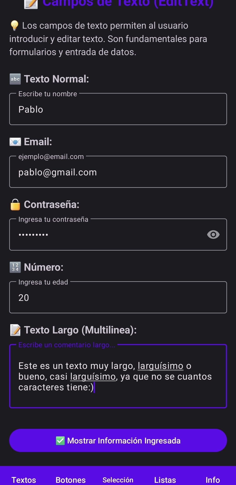
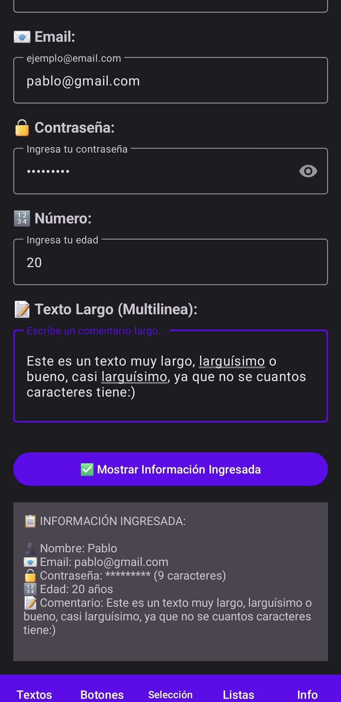
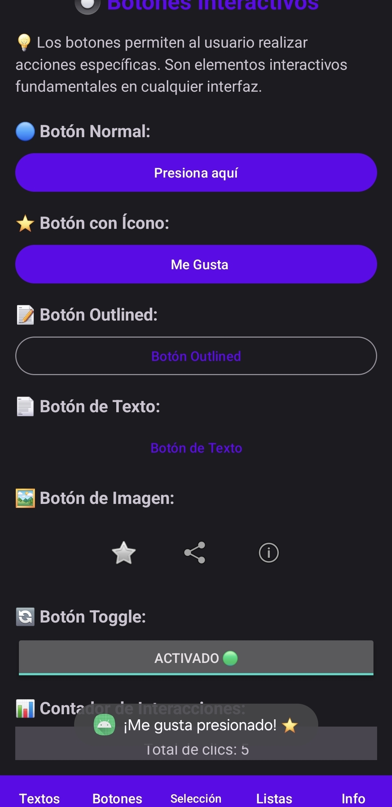
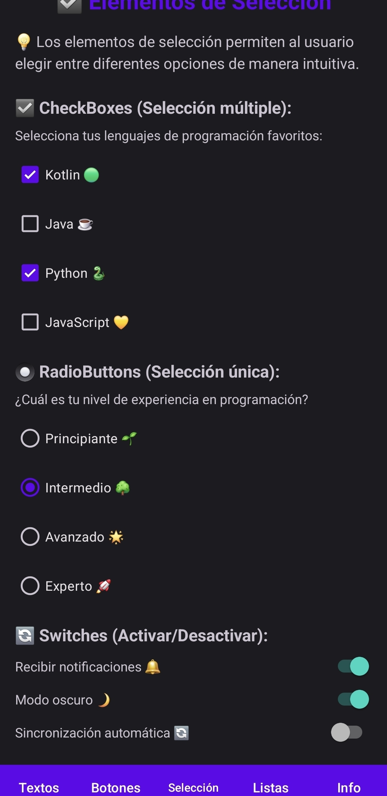
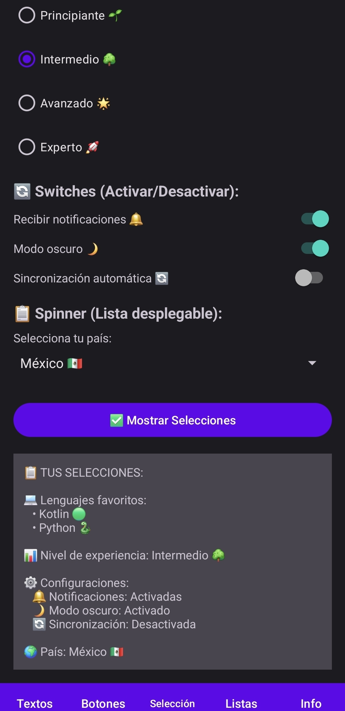
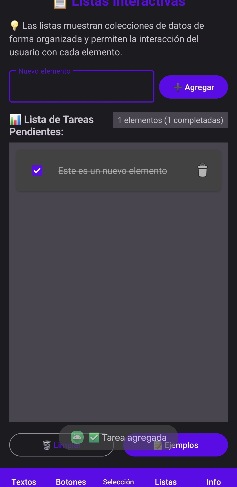
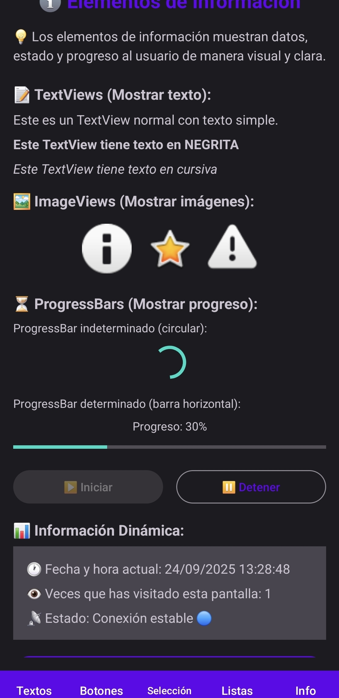

# 📱 UI Elements - App Android
## Granados Martínez Pablo Daniel

Aplicación Android que demuestra **5 Activities + 5 Fragments** con diferentes elementos de interfaz de usuario.

## 📸 Capturas de Pantalla

<div align="center">

### 🏠 Pantalla Principal


---

### 📱 Elementos de UI Implementados

</div>

#### 📝 **TextFields - Campos de Texto**
<p align="center">

</p>

#### � **Botones - Elementos Interactivos**  
<p align="center">

</p>

#### ☑️ **Selección - Checkboxes, Radio & Switches**
<p align="center">

<br><br>

</p>

#### 📋 **Listas**
<p align="center">

</p>

#### ℹ️ **Información - TextViews & Widgets**
<p align="center">

</p>

---

## ️ Estructura

```
MainActivity (menú principal)
├── TextFieldsActivity → TextFieldsFragment
├── BotonesActivity → BotonesFragment  
├── SeleccionActivity → SeleccionFragment
├── ListasActivity → ListasFragment
└── InformacionActivity → InformacionFragment
```

### Funcionalidades:

#### 📝 **TextFields Fragment**
- EditText normal, email, password, numérico y multilinea
- Validación de formato y botón demo interactivo

#### 🔘 **Botones Fragment** 
- Button normal, con ícono, outlined, text button, image buttons
- Contador de interacciones y feedback con Toast

#### ☑️ **Selección Fragment**
- CheckBoxes (selección múltiple), RadioButtons (selección única)
- Switches para configuraciones, Spinner con países

#### 📋 **Listas Fragment**
- RecyclerView con lista de tareas completa
- Agregar, eliminar y marcar como completadas

#### ℹ️ **Información Fragment**
- TextViews con estilos, ImageViews interactivos
- ProgressBars animados e información en tiempo real

## 🛠️ Tecnologías
- **Kotlin** | API 24+ | Material Design | ViewBinding | RecyclerView

## � Requisitos
- Android Studio Arctic Fox+
- JDK 8+
- SDK Android API 24+ (Android 7.0)
- Gradle 8.0+

## �🚀 Instalación
```bash
git clone https://github.com/PabloGranados/Moviles.git
cd Moviles
```
1. Abrir en Android Studio  
2. Sync Gradle dependencies
3. Conectar dispositivo/emulador
4. Run (Shift+F10)

## 📖 Uso
Ver `INSTRUCCIONES_USO.txt` para guía detallada de cada funcionalidad.